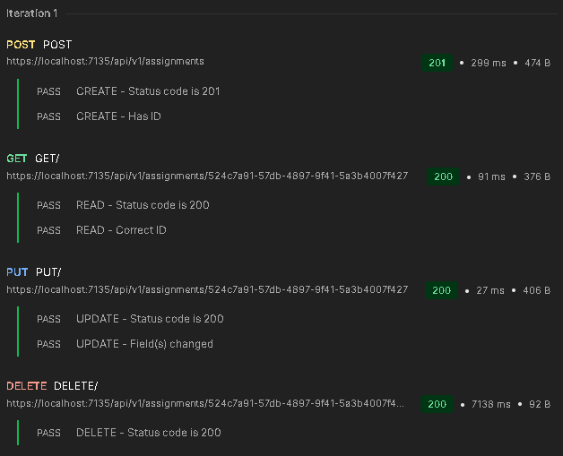
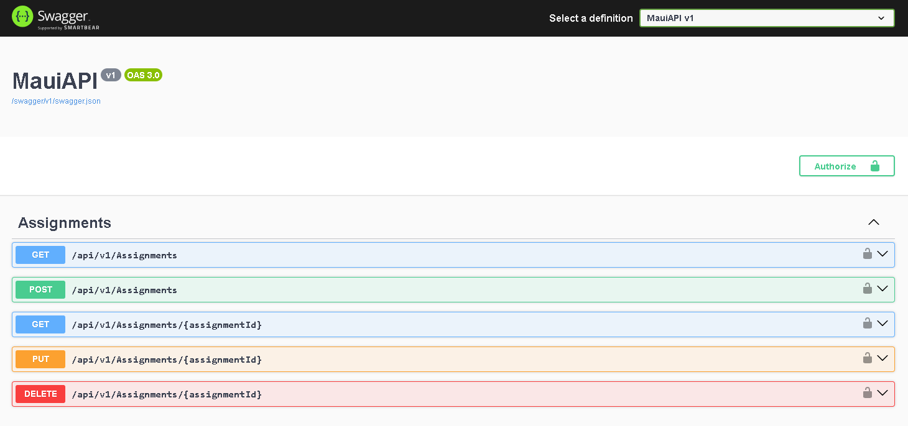

## Run the project

Run the `Marwalsch.MauiAPI` in the default `https` configuration. Successful startup should be indicated by the swagger dashboard launching in the default browser.

To access the API from a mobile device, forward the locally hosted API using tunneling software like [ngrok](https://ngrok.com/). In this case the base URL targeted in `MauiAppBuilderExtensions` must be updated accordingly.
```
services.AddMauiAppDataServices(options => 
{
  options.ApiKey = $"{Common.AuthorId}";
  options.BaseUrl = $"https://{**********}.ngrok-free.app/api/{Common.ApiVersion}";
});
```

## Run the API tests

Integration tests using [Postman](https://www.postman.com/) have been chosen in opposition to unit tests to reduce the necessity of Mocking the HTTP request pipeline and achieve larger test coverage with less effort. 

Import the postman collection from the eponymous folder and use the collection runner to verify the methods' basic functionality. When testing individual methods the `assignmentId` collection variable may need to be updated to target the correct resource.



You can also use the swagger dashboard to run individual methods. Ensure requests are authorized beforehand.



## Disclaimer

This is a very minimal sample for demonstration's sake containing many loose ends to be tied and improvements to be made. These include but are not limied to:
* proper validation on both the client's UI and the API;
* logging, telemetry and crash-reporting;
* robust error-handling on client and server respectively, including appropriate status codes for the latter;
* more user-friendly interfaces;
* server-side ordering and filtering and proper pagination;
* client-side data caching;
* a proper authentications scheme;
* enhanced authorization including resource-based rules;

in no particular order of priority.

Portions of the client app are loosely based on [jamesmontemagno/app-monkeys](https://github.com/jamesmontemagno/app-monkeys).
